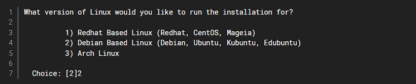
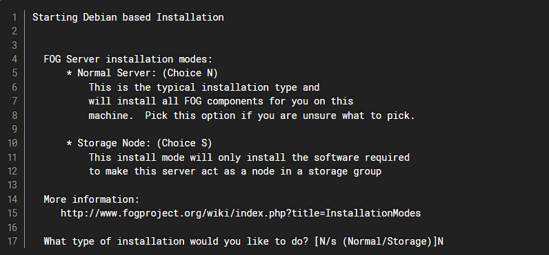
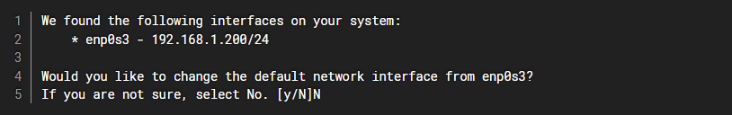
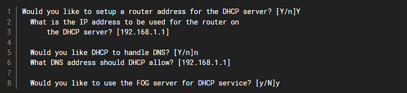
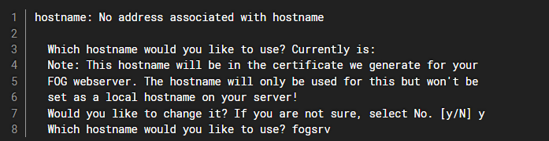

**SP 2 : Gestion du Parc Informatique**

**Mission 3 : Outil de déploiement des postes**

**Contexte : MILLENUITS**


___
## Informations générales

- __Auteur__ : Biseray Louis
- __Date de création__ : 05/03/2026
- **Sujet** : Installation de FOG

___

# Introduction 

Mise en place de Debian sur NUTANIX et installation du serveur qui servira au déploiement de FOG, une solution de déploiement pour Windows, Linux et Mac a partir du ``Master`` produit précédemment.

## Information :

Nom sur NUTANIX : ``SIO-AP-GP1-MN08``

Version Linux : ``Debian 13.2.0``

Réseau : ``Projet A - Vlan 51``

## Installation de Debian 13

La configuration du réseau sera à faire a la main après que celle ci ai échoué

| Langue              | Français       |
| ------------------- | -------------- |
| **Pays**            | France         |
| **Clavier**         | Français       |
| Adresse IP          | 172.16.51.7    |
| Passerelle          | 172.16.51.253  |
| Adresse de nom      | 1.1.1.1        |
| Nom de la machine   | debianFog      |
| Mot de passe "Root" | 123456         |
| Utilisateur         | userfog        |
| Mdp Utilisateur     | userFog        |
| Gestion des paquets | deb.debian.org |

Partitionner les disques avec l'assistance sur un seul disque entier avec une seul partition 
Finir par appliquer les changement sur le disques

___
# Installation du server

Maintenant que Debian est installer il faut mettre ne place le server pour ensuite déployer Fog
##  Prérequis 

Il faut d'abord installer `Sudo` et `Git`

- `apt install sudo`
- `apt -y install git`

**Explication des commandes :**

- `apt update` : Met à jour la liste des paquets disponibles dans les dépôts.

- `apt install` : Télécharge et installe les logiciels.

- `-y` : Option "Assume Yes". Elle automatise l'installation en répondant "oui" à toutes les demandes de confirmation, évitant ainsi l'arrêt de la procédure.

___
# Installation du Repo

Il faut cloner le Repo a l'intérieur de la racine. Voici les commande a suivre :

``` bash
cd /root 
git clone https://github.com/FOGProject/fogproject.git
cd fogproject/bin
./installfog.sh
```

Une fois le repo installer il faut aller chercher l'installeur `installfog.sh`:

- ``cd /root/fogproject/bin``
- ``.installfog.sh``

Explication :

___
# Installation de FOG

L'installeur va poser plusieurs question pour installer FOG sur la machine : 



La machine dans la situation fonctionne sous Debian il faut par conséquent choisir le 2.



Quel type d'installation choisir ? Pour cette situation il faut une installation Normal.



Ensuite les réglages réseau il ne faut pas les changer si la machine ne possède qu'une seul carte réseau.
 

Egalement régler le DHCP, on peut préciser l'adresse IP voulu pour le DHCP par défaut ce sera la passerelle de la machine.


Pour pouvoir passer l'installateur en français il faut répondre ``yes`` .



Ensuite le hostname a utiliser. Et valider l'installation FOG va vérifié la connexion internet et installer les paquets nécessaires.

Il faut se connecter au réseau avec un autre ordinateur pour avoir accées au site internet :

- Aller dans ``Réseau et Internet``
- Modifier les paramètres IP en ``manuel``
	- Adresse IP : 172.40.0.2
	- Masque : 255.255.255.0
	- Passerelle : 172.40.0.254
	- DNS : 9.9.9.9

Une fois l'installation des paquets fini FOG demande de se connecter au site Internet avec cette adresse ``172.16.51.7/fog/management``.

Pour se connecter : 
**Identifiant** : ``fog``
**Mot de passe** : ``password``

Cependant ces identifiants sont beaucoup trop faible pour un serveur il faut les modifier :
Pour modifier les identifiants de connexions

- Aller dans ``users``
- List all ``users``
- Cliquer sur l’utilisateur fog permettra de le modifier
- Modifier le nom par 
	- **Identifiant** : ``coussin_chaise_roulante``
	- **Mot de passe** : ``coussin_chaise_fog``

Pour passer en français :

 - Aller dans FOG Configurations
	 -  Dans Fog Settings
	 - General Settings
	 - Modifier Default Locale pour le Français

Voici pour l'installation de FOG sur Debian 13 ainsi que le paramétrage du compte principal
___ 
# Bibliographie

- [Documentation FOG server](https://docs.fogproject.org/en/latest/)
- [Guide d'installations](https://wiki.alexandre-faye.fr/fr/linux/fog)
