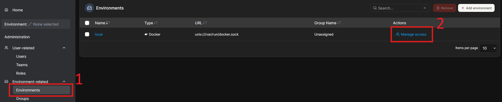

# SP 4 - Mission 1 - Configuration de Portainer sur MN21

**SP 4 : Mise en place d’un espace de développement**

**Mission 1 : Mise en place d’un environnement de test conteneurisé dans une DMZ interne avec Docker et préparation d’une formation développeurs.**

---

## Informations générales

  - **Date de création** : 03/04/2026
  - **Dernière modification** : 03/04/2026
  - **Mainteneur** : MEDO Louis

---

## Sommaire

  - A. Initialisation et Sécurisation de l'accès
  - B. Configuration des Accès Développeurs (RBAC)

---

## A. Initialisation et Sécurisation de l'accès

1.  **Définition du compte de secours Administrateur.** Lors de la première connexion sur `https://172.16.51.21:9443`, un compte d'urgence doit être créé. Ce compte ne sera utilisé qu'en cas de perte d'accès aux comptes nominatifs.

    * Générer un nom d'utilisateur non standard (éviter "admin") via Bitwarden.
    * Générer un mot de passe très fort (ex: 30 caractères) via Bitwarden et le sauvegarder dans le coffre-fort de l'équipe système.

---

## B. Configuration des Accès Développeurs (RBAC)

L'objectif est d'isoler les développeurs dans un espace contrôlé en appliquant le principe de moindre privilège.

1.  **Création du groupe logique "Développeurs".**

    * Aller dans **Users** > onglet **Teams**.
    * Saisir `Developpeurs` et cliquer sur **Create team**.
    *Explication* : L'attribution des droits se fait par équipe, ce qui simplifie l'onboarding de nouveaux développeurs.

2.  **Création des comptes nominatifs "Standard User".**

    * Aller dans **Users** > onglet **Users**.
    * Créer les comptes (ex: `pierre.jean`), attribuer un mot de passe initial et **décocher** impérativement *Administrator*.
    * Dans *Team memberships*, affecter l'utilisateur à l'équipe `Developpeurs`.

3.  **Délégation de l'environnement de développement.**

    * Aller dans **Environments-related** dans le menu de gauche et cliquer sur **Environnements**.
    * Cliquez sur **Manage access**, sélectionner l'équipe `Developpeurs` et cliquer sur **Create access**.
    * *Explication* : Les développeurs ont désormais le droit de créer des stacks, conteneurs et volumes, mais uniquement au sein de cet environnement.

    